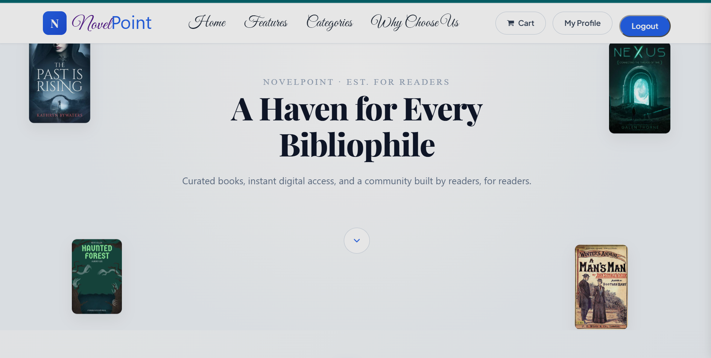
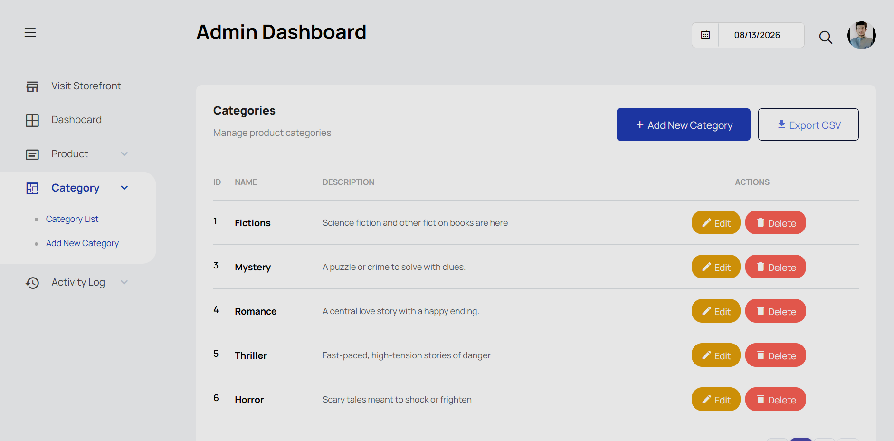
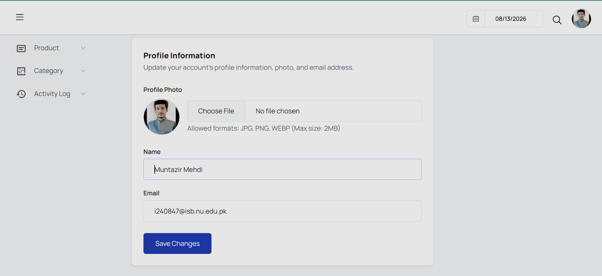

# 📚 NovelPoint

**A full-stack e-commerce platform built for readers — browse, cart, and checkout, backed by a purpose-built admin panel for managing a book catalog.**


---

## 📖 Overview

NovelPoint is an e-commerce web application purpose-built for selling books, novels, and literature — not a generic storefront with books bolted on. Every layer of the product model, from the database schema to the admin forms, is shaped around what a bookstore actually needs: authors, editions, ISBNs, and multi-image cover galleries.

The application serves two audiences from one codebase:

- **Readers & guests** get a smooth browsing experience with a persistent, session-based cart that works even before logging in.
- **Admins** get a full control panel for managing inventory, categories, and product media — with dual-layer validation to keep the catalog data clean.

---

## ✨ Key Features

### 🛍️ Customer & Guest Experience
- Browse the full catalog with category filtering
- Add to cart and adjust quantities as a guest — no login required
- Live-updating line totals and grand totals in the cart
- Instant toast feedback on quantity updates, item removal, and cart clears
- Product detail pages with an interactive image carousel and auto-sliding gallery
- Customer reviews and star ratings displayed per book

### 🛠️ Admin Capabilities
- Full CRUD on **Products**, **Categories**, and **product image galleries**
- Book-specific metadata per product: Author, Publisher, Language, ISBN, Page Count, Edition
- Multi-image support per product — upload local files or attach external image URLs
- Category-based product filtering in the admin product list
- CSV export for products and categories
- Dual-layer validation: client-side constraints (e.g. `min="1"` on page count) backed by server-side Laravel validation rules
- Defensive field fallbacks to handle legacy key-casing mismatches (e.g. `isbn` vs `ISBN`) without breaking the UI

---

## 🧰 Tech Stack & Architecture

| Layer | Technology |
|---|---|
| **Backend** | PHP 8.x, Laravel (MVC architecture) |
| **Frontend** | Blade templating, HTML5, CSS3, vanilla ES6 JavaScript |
| **Database** | MySQL, via Laravel Eloquent ORM |
| **Auth** | Laravel Authentication with role-based middleware (Admin vs. Customer/Guest) |

The app follows standard Laravel MVC conventions throughout: thin controllers, Eloquent models with defined relationships (`Product` → `Category`, `Product` → `ProductImage`), and Blade views composed from shared layout components.

---

## 🗄️ Database & Specialized Attributes

Products aren't stored as generic name/price/description rows. Each product links to a dedicated attributes table carrying:

- **Author**
- **Publisher**
- **Language**
- **ISBN**
- **Page Count**
- **Edition**

Product images live in their own table with a one-to-many relationship back to the product, supporting either uploaded files (stored on disk) or external URLs — resolved through a single fallback path so the display layer doesn't care which source a given image came from.

---

## 📁 Project Structure

```
NovelPoint/
├── app/
│   └── Http/
│       └── Controllers/
│           ├── ProductController.php     # Product CRUD, book attributes, validation
│           ├── CategoryController.php    # Category CRUD, CSV export
│           └── CartController.php        # Session cart state, quantities, totals
├── resources/
│   └── views/
│       ├── product-details.blade.php     # Book attributes, image gallery, reviews
│       ├── cart.blade.php                # Cart management, checkout redirect
│       └── admin/                        # Admin panel views (products, categories)
└── routes/
    └── web.php                           # Public, customer, and admin route definitions
```

---

## 📸 Screenshots

**Storefront**


**Admin Dashboard**


**User Profile**


---

## ⚙️ Installation & Setup

```bash
# 1. Clone the repository
git clone https://github.com/<your-username>/novelpoint.git
cd novelpoint

# 2. Install PHP dependencies
composer install

# 3. Install JS dependencies
npm install

# 4. Copy the environment file and generate an app key
cp .env.example .env
php artisan key:generate

# 5. Configure your database in .env
#    DB_DATABASE=novelpoint
#    DB_USERNAME=root
#    DB_PASSWORD=

# 6. Run migrations
php artisan migrate

# 7. (Optional) Seed sample categories and products
php artisan db:seed

# 8. Build frontend assets
npm run build

# 9. Start the development server
php artisan serve
```

Visit `http://127.0.0.1:8000` to browse the storefront, or log in with an admin account to reach the admin panel.

---

## 🔍 How It Works — Key Implementation Highlights

**Session-based cart.** Cart state is tracked server-side per session, so guests can shop without an account. On login, the cart persists and merges with any existing session data rather than being wiped — quantity changes, removals, and clears all route through `CartController` and return updated totals with a toast confirmation, no full page reload needed for feedback.

**Dual-layer validation.** Every admin form enforces constraints twice: HTML attributes (`required`, `min`, `type="number"`) catch obviously bad input before it's submitted, and Laravel's `$request->validate()` rules are the real gate — since client-side checks can be bypassed, nothing reaches the database without passing server-side validation first.

---

## 📄 License

This project is available under the MIT License.
